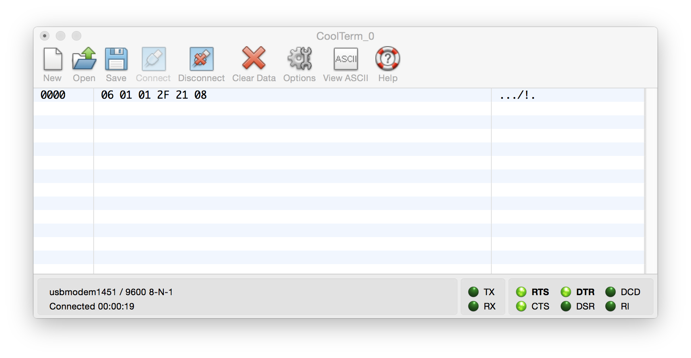
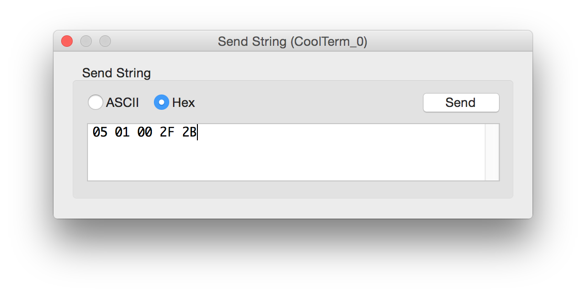

#Philips SICP emulator

Work in progress

Philips SICP emulator on Arduino. Send Philips SICP commands over a serial line to your Arduino.
Get valid SICP responses back from Arduino

The emulator 

- parses the incoming serial data
- looks for a control byte
- calculates the length
- validates the checksum





The emulator contains 2 byte arrays, one for the supported request commands, and one for the corresponding responses.

So when a client sends ```0x06,0x01,0x00,0xA2,0x00,0xA5``` he'll receive ```0x09,0x01,0x01,0xA2,0x31,0x2E,0x38,0x38,0xB4```.

```
byte requests[][10] = {  
                        {0x06,0x01,0x00,0xA2,0x00,0xA5},
                        {0x05,0x01,0x00,0x19,0x1D},
                        {0x05,0x01,0x00,0xAD,0xA9},
                        {0x05,0x01,0x00,0x2F,0x2B},
                        {0x05,0x01,0x00,0x62,0x66}
                    };


byte responses[][10] = {
                        {0x09,0x01,0x01,0xA2,0x31,0x2E,0x38,0x38,0xB4},
                        {0x06,0x01,0x01,0x19,0x02,0x1D},
                        {0x09,0x01,0x01,0xAD,0x06,0x00,0x01,0x00,0xA3},
                        {0x06,0x01,0x01,0x2F,0x21,0x08},
                        {0x06,0x01,0x01,0x62,0x04,0x60}
                     };
```

